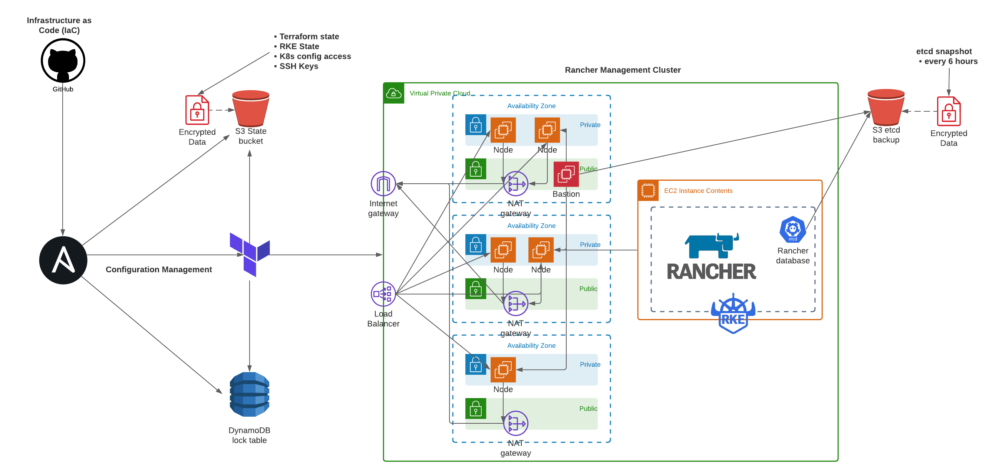

# rancher-ha-aws

Rancher, the open-source multi-cluster orchestration platform, where operational teams deploy, manage and secure enterprise Kubernetes built on RKE.

This Infrastructure as Code implents high-availability and reduant Kubernetes installation achieved by running Rancher on multiple nodes and accessed through Bastion Host.

## Docs

Get started with [Getting Started guide](https://github.com/nullobsidian/rancher-ha-aws/blob/master/docs/01%20-%20Getting%20Started/README..md) or review the rest of the Docs [here](https://github.com/nullobsidian/rancher-ha-aws/tree/master/docs).

## Authors

* **Moses Marquez** - [nullobsidian](https://github.com/nullobsidian)

See also the list of [contributors](https://github.com/GoldenHippoMedia/tsunami/contributors) who participated in this project.
